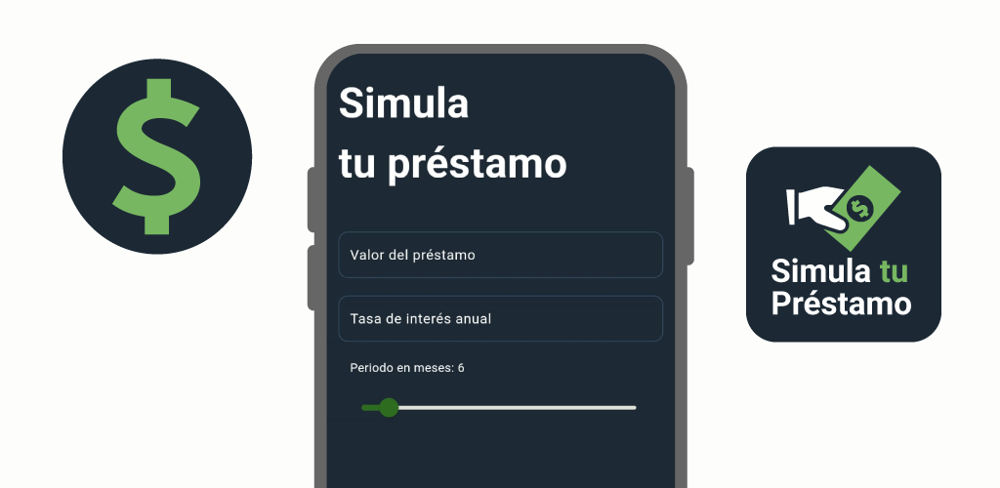

# Simula tu préstamo

### Simula las cuotas de un préstamo y planea tus pagos fácilmente

**Simula tu préstamo** es una aplicación gratuita que te ayuda a calcular el costo de un préstamo y ver si los pagos mensuales son asequibles. Simplemente ingrese el monto del préstamo, la tasa de interés y el plazo de pago, y la aplicación le mostrará cuánto deberá pagar cada mes, así como el monto total de interés que pagará durante la vigencia del préstamo.

Ya sea que estés planeando comprar una nueva computadora, ese auto que tanto deseas o necesitas un préstamo personal, "Simula tu préstamo" te dará una visión clara de tus opciones financieras. No más complicados cálculos manuales ni incertidumbre sobre los pagos mensuales. Con nuestra aplicación, tendrás la tranquilidad de saber exactamente qué esperar y cómo planificar tu futuro financiero.

¡Es como tener un asesor financiero personal en tu bolsillo! Puedes experimentar con diferentes escenarios y ajustar los parámetros según tus necesidades y posibilidades.

**Características:**

- Calcule los pagos mensuales para cualquier monto de préstamo, tasa de interés y plazo de pago
- Consulta la cuota mensual a pagar, interés total y el pago total del préstamo.

¡Descargue **Simula tu préstamo** hoy y comience a tomar decisiones financieras informadas!